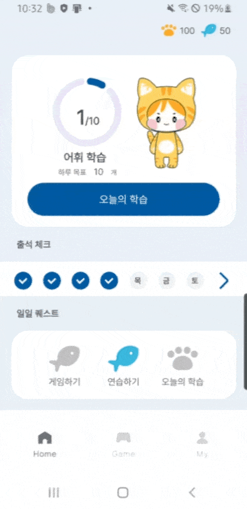
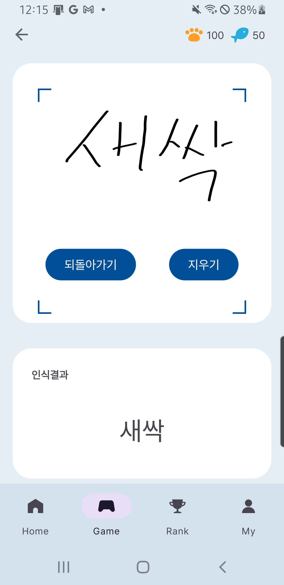
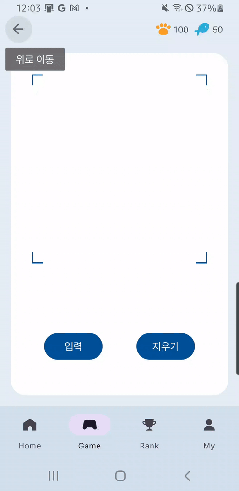

# 🪅KLang- 외국인을 위한 한국어 단어 학습 앱

## 1️⃣ 프로젝트 개요
* **KLang** 은 한국어능력시험인 TOPIK '초급' 단어를 학습 할 수 있는 앱입니다.

## 2️⃣ KLang 이란
* 학습 길잡이인 캐릭터 'K(케이)'😸와 함께 언어(Lang:랑)을 학습한다는 의미를 담은 **KLang(케이랑)** 을 앱의 이름으로 선정하였습니다.
* 사용자가 **학습목표를 설정**하고, 학습한 만큼 **포인트를 획득** 할 수 있는 앱입니다.
* 신뢰할 수 있는 단어데이터베이스인 **'한국어기초사전'API**에서 제공하는 단어 정보와 예문을 학습 할 수 있습니다.

## 3️⃣ 핵심기능

 ✅ **오늘의 단어 학습** 
  - 예문, 듣기, 말하기, 쓰기 기능을 통해 사용자가 직접 참여하는 학습
  - 북마크 기능을 통해 나만의 단어장 만들기

 

✅ **단어와 놀기 : MLKit 손글씨 인식기능*
* 사용자가 손글씨를 입력하면 그에 해당하는 한글 단어를 비교해서 보여줌

<table width="90%">
  <tr>
    <td width="45%" align="center">
      
    </td>
    <td width="45%" align="center">
      
    </td>
  </tr>
</table>

___
## 4️⃣ 기술 스택
| skills | 설명 |
|------------------------|------|
| **Serverless Firebase Firestore** | 데이터 저장 및 동기화 구현 |
| **MVVM 아키텍처 패턴** | 멀티 모듈 적용 |
| **ViewModel & StateFlow** | 상태 관리 |
| **DataStore** | 설정 및 전역 변수 관리 |
| **RoomDB** | SSOT(Single Source Of Truth)와 Offline First 구현 |
| **MLKit DigitalInk** | 손글씨 인식 기능을 onDevice로 구현 |
| **TTS/STT** | 인식 기능 전반 개발 |
| **Navigation Graph** | 앱 화면 전환 |
| **Jetpack Material3 UI/UX** | CorBind 적용 |
 

   
  
 

